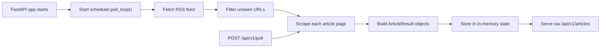

# Bar & Bench Scraper RSS API

A FastAPI-based scraping service that polls the Bar & Bench RSS feed, scrapes the full text of newly discovered articles, and exposes the collected data through a simple REST API.

This project is useful when you want a lightweight service that continuously watches Bar & Bench, converts feed entries into cleaner article records, and makes them available to other applications over HTTP.

## Overview

The application does three things:

1. Polls the Bar & Bench RSS feed every 5 minutes.
2. Scrapes each unseen article URL to extract the article body text.
3. Stores the scraped results in memory and serves them through FastAPI endpoints.

The current implementation is intentionally small and straightforward:

- RSS metadata such as title, author, published date, and category comes from the feed.
- Full article text comes from the article page HTML.
- State is in memory only, so restarting the app clears collected data.

## Features

- Automatic RSS polling on application startup
- Background polling every `300` seconds
- Deduplication of already-seen article URLs for the current process
- Full-text extraction from Bar & Bench article pages
- Paginated article listing API
- Manual poll trigger endpoint
- Manual single-URL scrape endpoint for Bar & Bench URLs
- Built-in FastAPI Swagger docs at `/docs`

## How It Works



## Tech Stack

- Python 3.13
- FastAPI
- Uvicorn
- feedparser
- httpx
- BeautifulSoup (`bs4`)
- lxml
- Pydantic

## Project Structure

```text
.
|-- api/
|   `-- routes.py          # FastAPI routes
|-- scraper/
|   |-- article.py         # Article-page HTML scraping logic
|   |-- feed.py            # RSS fetching and feed item extraction
|   `-- models.py          # Pydantic response model
|-- main.py                # FastAPI app entry point
|-- scheduler.py           # Background RSS polling loop
|-- state.py               # In-memory shared state
|-- pyproject.toml         # Project metadata and dependencies
`-- README.md
```

## Internal Flow

### 1. App startup

`main.py` creates the FastAPI application and uses a lifespan handler to start the background polling task:

- On startup, `scheduler.poll_loop()` is launched with `asyncio.create_task(...)`
- On shutdown, that task is cancelled cleanly

### 2. RSS polling

`scheduler.py` is responsible for the continuous polling loop:

- `POLL_INTERVAL = 300`
- The loop runs forever while the app is alive
- Each cycle fetches the RSS feed and processes unseen items

### 3. Feed parsing

`scraper/feed.py`:

- Reads `https://www.barandbench.com/feed`
- Uses `feedparser.parse(...)`
- Skips links that are already present in `state.seen_urls`
- Pulls metadata from RSS entries:
  - `title`
  - `published`
  - `author`
  - `category`

Category is derived from the last RSS tag when tags are present.

### 4. Article scraping

`scraper/article.py`:

- Requests the article HTML using `httpx`
- Parses it with BeautifulSoup and `lxml`
- Finds the first `<h1>`
- Collects `<p>` elements that appear after the `<h1>`
- Skips short or boilerplate paragraphs
- Joins the cleaned paragraphs into `full_text`

The scraper uses a custom user agent and removes recurring site-specific phrases such as app prompts or social prompts.

### 5. Shared state

`state.py` holds two in-memory structures:

- `seen_urls: set[str]`
- `articles: list[ArticleResult]`

New articles are inserted at the front of the list, so API responses return newest items first.

## Data Model

The API uses `ArticleResult` from `scraper/models.py`.

```json
{
  "url": "https://www.barandbench.com/...",
  "title": "Article title",
  "published": "Mon, 06 Apr 2026 10:00:00 GMT",
  "author": "Author Name",
  "category": "Litigation News",
  "full_text": "Paragraph 1...\n\nParagraph 2..."
}
```

Fields:

- `url`: article URL
- `title`: title from RSS
- `published`: raw published string from RSS
- `author`: author from RSS if available
- `category`: category from RSS tags if available
- `full_text`: cleaned body text extracted from the article page

There is also an internal `char_count` value computed in the model after initialization, but it is not part of the public FastAPI response schema.

## Requirements

- Python `>=3.13`
- Internet access to `https://www.barandbench.com`
- A tool for dependency installation:
  - `uv` recommended
  - `pip` also works

## Installation

### Option 1: Using `uv` (recommended)

```bash
uv sync
```

### Option 2: Using `venv` + `pip`

```powershell
python -m venv .venv
.venv\Scripts\activate
pip install -e .
```

## Running The Service

### Development

```bash
uv run python main.py
```

This starts Uvicorn from `main.py` on:

- Host: `0.0.0.0`
- Port: `8000`
- Reload mode: enabled

### Alternative

```bash
uv run uvicorn main:app --host 0.0.0.0 --port 8000 --reload
```

Once running:

- Swagger UI: `http://127.0.0.1:8000/docs`
- ReDoc: `http://127.0.0.1:8000/redoc`
- Health check: `http://127.0.0.1:8000/health`

## API Reference

### `GET /health`

Simple health endpoint.

Example:

```bash
curl http://127.0.0.1:8000/health
```

Response:

```json
{
  "status": "ok"
}
```

### `GET /api/v1/articles`

Returns scraped articles in reverse chronological insertion order.

Query parameters:

- `limit`: default `20`, maximum `100`
- `offset`: default `0`, minimum `0`

Example:

```bash
curl "http://127.0.0.1:8000/api/v1/articles?limit=10&offset=0"
```

Response shape:

```json
[
  {
    "url": "https://www.barandbench.com/...",
    "title": "Some title",
    "published": "Mon, 06 Apr 2026 10:00:00 GMT",
    "author": "Author Name",
    "category": "News",
    "full_text": "Paragraph 1...\n\nParagraph 2..."
  }
]
```

### `GET /api/v1/articles/count`

Returns the total number of scraped articles currently held in memory.

Example:

```bash
curl http://127.0.0.1:8000/api/v1/articles/count
```

Response:

```json
{
  "total": 42
}
```

### `POST /api/v1/poll`

Triggers an extra RSS polling run immediately without waiting for the next 5-minute cycle.

This endpoint returns quickly and starts the work in the background.

Example:

```bash
curl -X POST http://127.0.0.1:8000/api/v1/poll
```

Response:

```json
{
  "message": "Poll triggered"
}
```

### `POST /api/v1/scrape`

Manually scrapes a single Bar & Bench article URL.

Important behavior:

- `url` is sent as a query parameter, not a JSON body
- If the scheme is missing, the app prepends `https://`
- Only `barandbench.com` URLs are accepted

Example:

```bash
curl -X POST "http://127.0.0.1:8000/api/v1/scrape?url=https://www.barandbench.com/news/example-article"
```

Response shape:

```json
{
  "url": "https://www.barandbench.com/news/example-article",
  "title": "(manual scrape)",
  "published": null,
  "author": null,
  "category": null,
  "full_text": "Paragraph 1...\n\nParagraph 2..."
}
```

## Configuration

There is very little runtime configuration at the moment.

Current hardcoded values:

- RSS URL: `https://www.barandbench.com/feed`
- Poll interval: `300` seconds in `scheduler.py`
- Server port in `main.py`: `8000`

The repository includes a `.env` file, but the current code does not read environment variables yet.

## Notes On Async Behavior

Although FastAPI is asynchronous, parts of the scraper use synchronous libraries:

- `feedparser.parse(...)`
- `httpx.Client(...).get(...)`

To avoid blocking the event loop, the scheduler runs those calls inside the default thread pool via `loop.run_in_executor(...)`.

## Current Limitations

- Data is stored only in memory
- Restarting the app clears both `seen_urls` and `articles`
- Multiple app instances will not share state
- Poll interval is not configurable through environment variables
- There is no database, Redis, or file persistence yet
- There is no authentication or rate limiting on the API
- There are no automated tests in the repository yet
- The scraper depends on the current Bar & Bench HTML structure and RSS format
- The manual scrape path is centered on body extraction; it returns `title="(manual scrape)"` and `null` for feed-derived metadata, while the scheduled RSS path provides richer metadata from the feed

## Suggested Next Improvements

- Persist articles to SQLite, Postgres, or Redis
- Make poll interval configurable via environment variables
- Add retries, backoff, and structured logging
- Add filtering by date, category, or keyword
- Add tests for feed parsing and HTML extraction
- Add Docker support
- Add a persistent deduplication layer so URLs survive restarts

## Development Notes

- Package name in `pyproject.toml`: `legal-scraper`
- FastAPI app title in `main.py`: `Bar & Bench Scraper`
- The project currently targets one source only: Bar & Bench

## License

No license file is currently included in the repository.
